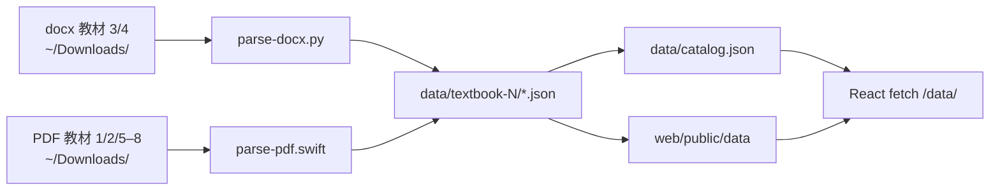

# RootGraph 项目交接文档

> **读者**：Hermes、Qorder 等后续接手的 AI Agent / 开发者  
> **目的**：在不依赖口头上下文的情况下，快速理解项目全貌、架构、约定与待办  
> **最后更新**：2026-08-20（教材 3/4 docx 导入、OCR 流水线已删除）  
> **仓库路径**：`/Users/charles/Projects/rootgraph`

---

## 0. 30 秒速览

| 项目 | 说明 |
|------|------|
| **是什么** | 个人用的 Web 词根学习工具，从「20000词汇巅峰速记营」PDF 教材提取词根族，以 Notion 式笔记 + 词根变体导航学习 |
| **技术栈** | React 19 + TypeScript + Vite 8 + 纯 CSS；无后端；数据为静态 JSON；持久化靠 localStorage |
| **数据源** | 8 本教材：1/2/5–8 用 PDF 文字层（Swift）；**3/4 用 docx**（Python）→ `data/` JSON → 前端 `fetch('/data/...')` |
| **当前规模** | **160** 个词根族（全部唯一）、**8389** 词（去重后；**8 本教材均已导入**） |
| **核心用户** | 项目所有者 Charles，个人学习用，非 SaaS |

**启动：**

```bash
cd /Users/charles/Projects/rootgraph/web
npm install && npm run dev
# → http://localhost:5173
```

**全量重导教材：**

```bash
/Users/charles/Projects/rootgraph/scripts/parse-all.sh
# 优先 docx：~/Downloads/20000词汇巅峰速记营（教材N）.docx
# 否则 PDF：~/Downloads/20000词汇巅峰速记营（教材N）.pdf
```

**给新 Agent 的首条提示词：** 见 [`AGENT_PROMPT.md`](./AGENT_PROMPT.md)（复制粘贴即可）

---

## 1. 产品定位与用户意图

### 1.1 要解决什么问题

用户学的是 **词根逻辑**，不是孤立背单词。理想路径：

```
语义场（如 separate / 区分·分别·单独）
  → 词根变体（cern / crim / cert / cris / crit / cree / cret）
    → 具体单词（discriminate, concern, crisis…）
      → 推理链 / 搭配 / 个人笔记
```

### 1.2 设计原则（历史对话中已确认）

- **图谱逻辑 + 笔记体验**：结构是网的，界面是浅色 Notion 式长文滚动，不是力导向技术大图谱
- **不做刷题 App**：核心是「看关系 → 理解 → 记笔记 → 复习」
- **个人笔记优先**：PDF 内容是种子，用户可在 localStorage 覆盖助记、搭配、词缀理解
- **最小改动**：迭代时保持 diff 小、匹配现有风格，避免过度抽象

### 1.3 三个主界面

| 界面 | 组件 | 作用 |
|------|------|------|
| 知识库首页 | `HomePage.tsx` | 按教材 / 章节 / 搜索浏览词根族卡片 |
| 词根族详情 | `FamilyNotePage.tsx` | 摘要、变体 Tab、单词卡、关系图、笔记 |
| 词缀库 | `AffixLibraryPage.tsx` | 前缀 / 后缀 / 词根条目 CRUD |

路由 **无 react-router**，在 `App.tsx` 用 `useState<AppView>` + **URL hash**（`appRoute.ts`）切换。支持 `#/family/textbook-1/cern?word=discriminate` 深链。

---

## 2. 目录结构

```
rootgraph/
├── HANDOFF.md              ← 本文档（架构 / 约定 / 待办）
├── AGENT_PROMPT.md         ← 给新 Agent 的首条提示词（复制粘贴用）
├── README.md               ← 简版说明（部分过时，以本文为准）
├── .gitignore
│
├── data/                   ← 解析后的 canonical 数据（source of truth）
│   ├── catalog.json        ← 全库索引（160 条 CatalogEntry）
│   ├── rootgraph.db        ← SQLite 分析库（build-sqlite.py 生成，gitignore，不进 public）
│   ├── affix-library-seed.json
│   ├── textbook-1/ … textbook-8/
│   │   ├── index.json      ← 该教材词根族列表
│   │   └── {id}.json       ← 单个 RootFamily（一章一词根族）
│
├── scripts/
│   ├── parse-docx.py       ← docx → JSON（教材 3、4）
│   ├── parse-pdf.swift     ← PDF 文字层 → JSON（教材 1、2、5–8）
│   ├── parse-all.sh        ← 批量 8 本 + dedupe + 重建 catalog + rsync 到 public + 构建 rootgraph.db
│   ├── build-sqlite.py     ← data/ JSON → data/rootgraph.db（SQLite 分析库，前端不依赖）
│   ├── dedupe-words.py     ← 同族内词条去重（同 word 保留信息量最大条目）
│   ├── import-affix-library.py ← docx → 词缀库 seed
│   └── import-affix-xlsx.py    ← 旧版 xlsx 导入
│
└── web/
    ├── package.json
    ├── vite.config.ts
    ├── public/
    │   └── data/           ← rsync 自 ../data（Vite 静态服务）
    └── src/
        ├── App.tsx         ← 路由 / 全局状态注入
        ├── appRoute.ts     ← hash 路由解析与深链
        ├── App.css         ← 几乎全部样式（~3800 行）
        ├── types.ts        ← 核心类型 + 工具函数
        ├── catalog.ts      ← 教材标签、章节筛选
        ├── components/     ← 17 个 TSX 组件
        ├── hooks/          ← 4 个 hook
        ├── utils/          ← 工具模块
        └── data/
            ├── affixSeed.ts
            └── affix-library-seed.json
```

---

## 3. 技术栈与依赖

| 层 | 技术 |
|----|------|
| UI | React 19.2, TypeScript 6, Vite 8 |
| 样式 | 单文件 `App.css`，无 Tailwind / UI 库 |
| Lint | oxlint |
| 解析 | Swift + PDFKit |
| 脚本 | Bash, Python 3（stdlib） |
| 持久化 | localStorage only |

**注意**：README 写「React Flow」，但 **从未安装或使用**。关系图是手写 CSS 组件 `MiniRelationGraph.tsx`。

---

## 4. 数据流水线



### 4.1 解析单本

**docx（教材 3、4）：**

```bash
python3 /Users/charles/Projects/rootgraph/scripts/parse-docx.py \
  ~/Downloads/20000词汇巅峰速记营（教材3）.docx \
  /Users/charles/Projects/rootgraph/data/textbook-3 \
  textbook-3
```

**PDF 文字层（教材 1、2、5–8）：**

```bash
swift /Users/charles/Projects/rootgraph/scripts/parse-pdf.swift \
  ~/Downloads/20000词汇巅峰速记营（教材1）.pdf \
  /Users/charles/Projects/rootgraph/data/textbook-1 \
  textbook-1
```

> **注意**：教材 3、4 的 PDF 是扫描版，**无可靠文字层**。已弃用 OCR 流水线；请始终使用 docx。教材 1、2、5–8 **不需要** Word 版。

### 4.2 批量解析

```bash
/Users/charles/Projects/rootgraph/scripts/parse-all.sh
```

会做五件事：

1. 循环教材 1–8：**有 docx 用 docx**，否则用 PDF（不存在则跳过）；解析结果为 0 族时**中止**（保护旧数据）
2. `dedupe-words.py` 去重同族重复词条
3. Python 内联脚本合并各 `textbook-N/index.json` → `data/catalog.json`（wordCount 以家族文件实际词数为准）
4. `rsync -a --delete data/ → web/public/data/`（`--exclude '*.db'`）
5. `scripts/build-sqlite.py` → `data/rootgraph.db`（SQLite 分析库：families/words/affixes + FTS5）

> **rootgraph.db 是分析用途**（`sqlite3 data/rootgraph.db "SELECT ..."`），前端仍 fetch 静态 JSON，不依赖 db。构建时报告 catalog 重复家族键与同族重复词条。

### 4.3 词缀库 seed 导入

```bash
python3 /Users/charles/Projects/rootgraph/scripts/import-affix-library.py
# 默认读 ~/Downloads/词根词缀/词根词缀.docx
# 输出 web/src/data/affix-library-seed.json + data/affix-library-seed.json
# npm run import:affix 等价
```

Seed 版本号：`AFFIX_SEED_VERSION = 'docx-v14'`（`web/src/data/affixSeed.ts`）。版本变化会触发与用户 localStorage 的 merge / 迁移。v14：删除噪声条目 `o??-`（p013，前缀）；merge 逻辑在 seed 变化时保留用户编辑与新增条目（仅过滤 `??` 噪声）。

### 4.4 数据现状（2026-08-20）

| 指标 | 数值 |
|------|------|
| catalog 词根族 | **160**（全部唯一键，无重复） |
| 总词数 | **8389**（同族重复词条 55 条已去重） |
| 已解析教材 | **1–8 全部** |

| 教材 | 来源 | 家族数 | 词数 |
|------|------|--------|------|
| textbook-1 | PDF | 11 | 1005 |
| textbook-2 | PDF | 10 | 912 |
| **textbook-3** | **docx** | 14 | 454 |
| **textbook-4** | **docx** | 19 | 1453 |
| textbook-5 | PDF | 41 | 1551 |
| textbook-6 | PDF | 37 | 1540 |
| textbook-7 | PDF | 20 | 734 |
| textbook-8 | PDF | 8 | 740 |

> **注意**：textbook-5/6 各含 slug 撞车产生的 `-2`/`-3` 后缀族（如 plus + plus-2、reg + reg-2 + reg-3），是不同章节独立词根族，非重复。

**教材 3/4 说明：**

- docx 路径：`~/Desktop/2w/20000词汇巅峰速记营（教材3）.docx` / `（教材4）.docx`（parse-all.sh 双路径查找，Downloads 也有教材 4 副本）
- TB3：14 章（maj, min, itude, dict, em, spect, scopy, cal, claim, duct, viv, bio, zoo, quick）
- TB4：19 章、1487 词（docx 内部分章节合并为一个大族，如 forward 开篇族；quire 有两段 `quire` / `quire-2`）
- zoo 族仅 1 词（`zoo` 本身），其余 zoo 相关词在 bio 章

**仍存在的噪声：**

- 部分章节 `titleZh` / `semanticLabel` 来自 docx 原文，可后续用 xlsx 元数据优化
- `-ics` 学科词误标 `rootHint: cern`（economics 等）待清理

---

## 5. 数据模型

### 5.1 TypeScript 类型（`web/src/types.ts`）

```typescript
// 单词（PDF 解析产物 + 用户可覆盖字段）
interface WordEntry {
  word: string;
  phonetic?: string;
  pos?: string;
  definition?: string;
  frequency?: number;
  mnemonic?: string;        // 助记 / 推理链种子
  collocations: string[];
  etymology?: string;
  examples: string[];
  rootHint?: string;        // 所属词根变体，如 "crim"
}

// 词根族（一个 JSON 文件 = 一章）
interface RootFamily {
  id: string;               // 如 "cern"
  source: string;           // "textbook-1"
  chapter: string;          // "五"
  chapterOrder?: number;
  titleZh: string;
  semanticLabel?: string;   // 如 "separate"
  meaningEn?: string;
  meaningZh?: string;
  roots: string[];          // ["cern","crim","cert",...]
  words: WordEntry[];
}

// 目录索引条目
interface CatalogEntry {
  id: string;
  file: string;             // "cern.json"
  textbook: string;
  roots: string[];
  wordCount: number;
  // ...
}
```

### 5.2 Key 命名约定

```typescript
familyStorageKey(textbook, familyId)  // "textbook-1/cern"
wordKey(textbook, familyId, word)   // "textbook-1/cern/discriminate"
catalogEntryKey(entry)              // "textbook-1/cern"
```

所有 localStorage 笔记、词缀、字段覆盖都用 `wordKey` / `familyStorageKey`。

### 5.3 示例：separate 词根族

- 文件：`data/textbook-1/cern.json`
- 语义：`separate`（区分·分别·单独）
- 变体：`cern, crim, cert, cris, crit, cree, cret`
- 词数：169（分组后 cern 约 138，crim 5，cert 5…）
- **已知数据问题**：大量 `-ics` 学科词（如 `economics`）被误标 `rootHint: "cern"`，与 separate 词根无关；JSON 内 `economics` 重复出现 2 次

---

## 6. 前端架构

### 6.1 路由状态（`App.tsx` + `appRoute.ts`）

```typescript
type AppView =
  | { kind: 'home' }
  | { kind: 'family'; entry: CatalogEntry; focusWord?: string }
  | { kind: 'affix-library' };
```

- Hash 路由：`#/` 首页，`#/affix-library` 词缀库，`#/family/textbook-1/cern?word=discriminate` 词根族深链
- `HomePage` → 点击卡片 → `applyView({ kind: 'family', entry })`
- 单词搜索 → 带 `focusWord` 跳转并滚动定位
- 浏览器前进/后退通过 `hashchange` 同步

Hooks 在 `App` 顶层实例化，通过 props 下发：

- `useNotes()` — 家族/单词/词缀/字段覆盖
- `useAffixLibrary()` — 词缀库 CRUD + seed merge

### 6.2 组件地图

```
App.tsx
├── HomePage
│   ├── 教材 / 章节 / 文本筛选
│   └── WordSearchResults（全局单词搜索）
├── FamilyNotePage
│   ├── FamilyVariantNav（变体 Tab：概览 + cern/crim/…）
│   ├── VariantMap（拼写变体对照）
│   ├── MiniRelationGraph（可折叠关系图）
│   ├── NoteEditor（家族级笔记）
│   ├── WordCard × N（列表内折叠卡）
│   │   ├── RootText（词根高亮）
│   │   ├── NoteEditor（我的笔记 / 推理链 / 搭配）
│   │   └── AffixModal × 2（前缀 / 后缀）
│   ├── WordCardModal（复习弹窗，接 useProgress）
│   └── AffixLibraryOverlay（词缀库浮层，Home/Family/AffixModal 共用）
└── AffixLibraryPage
    ├── 分页表格 + 搜索
    └── AffixItemModal
```

**已实现但未接入 UI 的组件：**

- `WordBreakdown.tsx`
- `AffixRelatedWords.tsx`

### 6.3 核心 Hooks

| Hook | 文件 | 职责 |
|------|------|------|
| `useNotes` | `hooks/useNotes.ts` | 家族笔记、单词笔记、词缀笔记、mnemonic/collocations 覆盖 |
| `useAffixLibrary` | `hooks/useAffixLibrary.ts` | 723 条 seed + 用户编辑 merge；防 localStorage 污染 |
| `useWordIndex` | `hooks/useWordIndex.ts` | 懒加载全库单词索引（搜索用） |
| `useProgress` | `hooks/useProgress.ts` | 复习状态 new/understood/review — **已通过 WordCardModal 部分接入** |

### 6.4 核心 Utils

| 文件 | 职责 |
|------|------|
| `utils/family.ts` | `groupWordsByRoot()` 按变体分组；`familySummary()` |
| `utils/rootHighlight.ts` | 词根匹配、变体簇、高亮 |
| `utils/affixLibrary.ts` | 词缀库搜索、分组 CRUD、libraryRef 解析 |
| `utils/affixNote.ts` | 从助记推断词缀、seed 词缀笔记 |
| `utils/markdown.tsx` | 轻量 Markdown 渲染（NoteEditor 预览） |

### 6.5 词根变体分组逻辑（重要）

`groupWordsByRoot(words, roots)` in `utils/family.ts`：

1. `cleanRoots(roots)` 清洗词根列表
2. 对每个单词：
   - **优先** `rootHint` 精确匹配
   - 其次 `rootHint` 包含词根（按词根长度降序，避免 `crit` 误匹配 `cris`）
   - 再次 `word` 包含词根（同样最长优先）
   - 否则落入第一个词根（fallback）

`FamilyNotePage` 用分组结果驱动变体 Tab；仅当 `variantTabs.length > 1` 时显示变体导航。

---

## 7. 功能清单（已实现）

### 7.1 首页（HomePage）

- 教材下拉、章节 chip 筛选
- 文本搜索（匹配词根、语义、章节）
- 词根族卡片：显示词根链、语义、词数
- 入口：词缀库

### 7.2 词根族页（FamilyNotePage）

- **概览 Tab**：摘要、变体对照、家族笔记、关系图
- **变体 Tab**（如 cern / crim / cert）：仅显示该变体下的单词卡
- 底部 `VariantStepper` 切换变体
- 从搜索进入时 `focusWord` 自动切 Tab 并滚动定位

### 7.3 单词卡（WordCard）

- 词根高亮标题、音标、词性、释义、词频
- 变体标签（canonical → form）
- **我的笔记**（Markdown 可编辑）
- **更多** 展开：推理链、搭配、例句、词源
  - 推理链 / 搭配可编辑，覆盖 PDF 种子，存 localStorage
  - 「更多」有内容时蓝色，无内容灰色；无内容也可点开录入
- 前缀 / 后缀按钮 → `AffixModal`
- 点击单词复制

### 7.4 词缀库（AffixLibraryPage + useAffixLibrary）

- 三类 Tab：词根 / 前缀 / 后缀
- 723 条 seed（docx 导入，`docx-v14`）
- 父子组结构（`isParent`, `parentId`）
- 单词词缀弹窗可「保存到词缀库」、关联 `libraryRef`
- 弹窗点「完成」自动保存（无单独「保存词缀库」按钮）
- 标题前缀高亮（`highlightWordAffix`）
- 防 corrupted localStorage 释义（如前缀条目被写成「名词后缀」）

### 7.5 搜索

- 目录级：HomePage 文本 filter
- 单词级：`WordSearchResults` + `useWordIndex`（word/phonetic/definition/mnemonic）
- 词缀弹窗内：按词缀形式搜关联词（本章 / 本教材 / 全库）

---

## 8. localStorage 持久化

| Key | Hook | 内容 |
|-----|------|------|
| `rootgraph-notes-v2` | useNotes | `{ families, words, affixNotes, wordFields }` |
| `rootgraph-notes-v1` | useNotes | 只读 legacy，部分迁移 |
| `rootgraph-affix-library-v5` | useAffixLibrary | `AffixItem[]` |
| `rootgraph-affix-library-seed-version` | useAffixLibrary | 如 `'docx-v12'` |
| `rootgraph-progress-v1` | useProgress | `{ [wordKey]: status }` — WordCardModal 已用 |

### wordFields 结构

```typescript
wordFields[wordKey] = {
  mnemonic?: string;      // 覆盖 PDF 助记
  collocations?: string;  // 覆盖 PDF 搭配（换行分隔）
}
```

### 开发注意

- **不要**在代码里硬编码真实 API Key / 密码
- 修改 seed 版本或结构时，考虑用户 localStorage 迁移
- 词缀库 merge 逻辑复杂，改 `useAffixLibrary.ts` 前先读 `isCorruptedMeaningOverride` 等守卫

---

## 9. 开发命令

```bash
# Web
cd web
npm install
npm run dev          # http://localhost:5173
npm run build        # tsc -b && vite build → dist/
npm run preview
npm run lint         # oxlint
npm run import:affix # 重新导入词缀 docx

# 数据
./scripts/parse-all.sh
python3 scripts/parse-docx.py <docx> <outdir> <label>   # 教材 3/4
swift scripts/parse-pdf.swift <pdf> <outdir> <label>    # 教材 1/2/5–8
python3 scripts/import-affix-library.py
python3 scripts/build-sqlite.py                          # 单独重建 SQLite 分析库
```

### 验证改动

1. `npm run build` 必须通过（strict TS：`noUnusedLocals`, `noUnusedParameters`）
2. 浏览器手测：Home → 教材1 → cern（separate）→ 切换 crim/cert Tab
3. 若改 parser：重跑 `parse-all.sh`，检查 `critical` 等词助记/搭配是否完整

---

## 10. Git 状态

### 已提交（2 commits）

| Hash | 说明 |
|------|------|
| `70ba8d3` | Initial commit：全量 PDF 重导；修复 parse-pdf 多行释义/助记/搭配 |
| `4a79697` | .gitignore 忽略 `__pycache__` |

### 未提交改动（2026-08-20，本地 working tree）

**尚未 commit 的大量本地改动**，包括但不限于：

**数据 / 脚本：**
- `scripts/parse-docx.py`（新）— docx 解析器
- `scripts/parse-all.sh` — docx 优先逻辑
- `data/catalog.json`、`data/textbook-3/*`、`data/textbook-4/*` — 全量重导
- 已删除：`ocr-pdf-paddle.py`、`ocr-pdf-to-text.sh`、`diagnose-pdf.swift`、`dump-pdf-snippet.swift`

**前端：**
- `web/src/appRoute.ts`（新）— hash 深链
- `web/src/components/WordCardModal.tsx`、`AffixLibraryOverlay.tsx`（新）
- `FamilyNotePage.tsx` — 变体 Tab、复习弹窗
- `WordCard.tsx` — 可编辑推理链/搭配
- `useNotes.ts` — wordFields 持久化
- `utils/family.ts` — groupWordsByRoot 改进
- 词缀库相关（`AffixModal`、`affixSeed.ts` docx-v13 等）

**接手的 Agent 必须先 `git status` / `git diff --stat`，不要假设 HEAD 即最新功能。**

---

## 11. 已知问题与近期修复

### 11.1 已修复

| 问题 | 修复 |
|------|------|
| PDF 单词缺助记/搭配/释义尾 | `parse-pdf.swift` 多行解析 + 重导 |
| 词缀库 localStorage 污染（dis- 显示「名词后缀」） | seed 过滤 + `saveGroup` 保留 id |
| 前缀弹窗编辑后不保存 | 点「完成」自动写入 |
| separate 词根族切换 crim/cert Tab 仍显示 economics | `FamilyNotePage` useEffect 不再反复重置 Tab |
| 首页「携带·运输」误收录 plat 词根族 | catalog 分类改精确词根匹配 |
| **教材 3、4 为空 / OCR 质量差** | 改用 docx + `parse-docx.py`；OCR 流水线已删除 |
| TB3 仅 8 族 365 词（OCR） | docx 导入 → 14 族 461 词 |
| TB4 OCR 1282 词 | docx 导入 → 19 族 1487 词 |
| 词缀库 `o??-` 噪声条目误推断（如 optics → o-） | 删除 seed 条目（docx-v14）；`inferAffixFromLibrary` 跳过单字母 form（o-/e-/s-/a- 首字母匹配误报，optics 不再推断 o-、outline 不被 o- 截胡）；词缀库/助记匹配的实义词缀恢复自动绑定+释义（如 diagnosis → dia-）；纯拼写推断只填形（`inferred` 标记）；`AffixModal` 统一「解除引用 / 无此词缀」入口：清空 + `suppressed` 防回填 + 撤销 |
| catalog 9 个重复家族键（slug 撞车） | `parse-pdf.swift` 无 id 冲突处理，后章覆盖前章文件 → 丢 176 词（textbook-5: plus/pos/cap，textbook-6: mis/solv/reg/rog/dec）。已加 `usedIds` 后缀（-2/-3）+ 写前清理旧 JSON，全量重导找回全部词 |
| 同族重复词条 55 个 | 新增 `scripts/dedupe-words.py`（同 word 保留信息量最大条目），`parse-all.sh` 解析后自动执行 |
| **教材 4 docx 源文件丢失** | 重导时扫描 PDF 解析 0 族并清空目录；已从 `web/dist` 旧构建副本恢复 19 族 1453 词；`parse-all.sh` 加 0 族保护（解析结果为 0 时中止，不再清空） |

### 11.2 未解决 / 数据层

| 问题 | 说明 |
|------|------|
| `-ics` 词误归 cern | 如 economics、electronics，rootHint 错 |
| 章节 title 粗糙 | 尤其 docx 导入的 TB3/4，可用 xlsx 元数据优化 |
| TB4 章节合并 | docx 内多 TOC 条目合并为 19 族（非 51 族），但词数完整 |
| 孤儿文件备份 | 60 个旧 orphan JSON（含 gnor.json 等有数据文件）备份在 `/tmp/rootgraph-orphan-backup/`，如需恢复可手动并入 |
| README 过时 | 词数、React Flow、路由等与现状不符 |

### 11.3 代码层待接

| 项 | 位置 | 说明 |
|----|------|------|
| 复习标记 UI | `useProgress.ts` + `WordCardModal` | 弹窗已接，列表/首页统计可继续完善 |
| 推理链 step 渲染 | `parseMnemonicChain()` | 函数在 family.ts，UI 用纯文本 NoteEditor |
| 死代码组件 | WordBreakdown, AffixRelatedWords | 删除或接入 |
| public/data symlink | 绝对路径 | 换机器可能失效；靠 parse-all.sh rsync |

---

## 12. 编码约定（后续 Agent 请遵守）

1. **最小 diff**：只改任务相关文件，不顺手重构
2. **不加无关注释**：代码自解释为主
3. **匹配现有风格**：纯 CSS、props 下发 hooks、fetch 静态 JSON
4. **不引入新 UI 库 / 状态库**，除非用户明确要求
5. **不提交 .env / 密钥**；credentials 用环境变量
6. **改 parser 后必须重导并 spot-check** 典型词（critical, discriminate, economics）
7. **改 localStorage schema 必须写迁移**，并 bump 版本 key
8. **commit 只在用户明确要求时创建**（用户规则）

### 样式

- 几乎全部在 `App.css`
- 浅色 Notion 风：`--surface`, `--border`, `--accent` 等 CSS 变量
- 词根高亮：`.root-mark`, `.root-mark-variant`
- 变体导航：`.family-variant-nav`, `.family-variant-tab`

### 测试

- 无自动化测试套件
- 依赖 `npm run build` + 手动浏览器验证

---

## 13. 常见任务指南

### 13.1 新增 UI 功能

1. 读 `App.tsx` 看 view 状态是否需扩展
2. 类型放 `types.ts`
3. 需持久化 → 扩展 `useNotes` 或 `useAffixLibrary`， bump storage key
4. 样式追加 `App.css`（不要新建 scattered CSS 除非有必要）

### 13.2 修复 docx / PDF 解析

**docx（教材 3、4）：**
1. 改 `scripts/parse-docx.py`（章节头检测、词条 regex、Unicode 引号等）
2. `python3 scripts/parse-docx.py <docx> data/textbook-N textbook-N`
3. 或跑 `parse-all.sh`

**PDF 文字层（教材 1、2、5–8）：**
1. 改 `scripts/parse-pdf.swift`
2. 跑单本 swift 或 `parse-all.sh`
3. 检查 `data/textbook-N/{id}.json` 字段

两者完成后 `web/public/data` 会通过 rsync 同步。

### 13.3 词缀库更新

1. 更新 docx 源文件
2. `npm run import:affix`
3. bump `AFFIX_SEED_VERSION` in `affixSeed.ts`
4. 验证 `useAffixLibrary` merge 不覆盖用户有效编辑

### 13.4 修复变体 Tab / 单词分组

- 分组逻辑：`web/src/utils/family.ts` → `groupWordsByRoot`
- UI 逻辑：`web/src/components/FamilyNotePage.tsx`
- 导航组件：`web/src/components/FamilyVariantNav.tsx`
- 测试族：`data/textbook-1/cern.json`（separate，7 个变体）

---

## 14. 产品 Backlog（用户可能继续提）

按历史对话优先级排列：

1. **完善复习标记 UI**（WordCardModal 已有，可接列表标记、首页统计）
2. **清理 cern 组误分类词**（-ics 学科词移出或改 rootHint）
3. **PDF/docx 去重**（economics 等重复 entry）
4. **清理 orphan JSON / 改进 slugify**
5. **用 xlsx 优化 TB3/4 章节 title**（`~/Downloads/20000词汇词根总结表.xlsx` 讲义3/4 仅 metadata）
6. **推理链 step-by-step 展示**（用 parseMnemonicChain + 已有 CSS）
7. **更新 README** 与本文档同步
8. **推理 quiz 模式**（曾讨论，未做）

---

## 15. 关键文件速查

| 目的 | 路径 |
|------|------|
| 入口 | `web/src/main.tsx` |
| 路由 | `web/src/App.tsx` + `web/src/appRoute.ts` |
| 类型 | `web/src/types.ts` |
| 全库索引 | `data/catalog.json` |
| docx 解析 | `scripts/parse-docx.py` |
| PDF 解析 | `scripts/parse-pdf.swift` |
| 批量脚本 | `scripts/parse-all.sh` |
| 词根族页 | `web/src/components/FamilyNotePage.tsx` |
| 复习弹窗 | `web/src/components/WordCardModal.tsx` |
| 单词卡 | `web/src/components/WordCard.tsx` |
| 词缀库页 | `web/src/components/AffixLibraryPage.tsx` |
| 笔记持久化 | `web/src/hooks/useNotes.ts` |
| 词缀库持久化 | `web/src/hooks/useAffixLibrary.ts` |
| 词根分组 | `web/src/utils/family.ts` |
| 样式 | `web/src/App.css` |
| 示例词根族 | `data/textbook-1/cern.json` |

---

## 16. 给 AI Agent 的启动清单

接手新任务时，按顺序执行：

- [ ] 读 [`AGENT_PROMPT.md`](./AGENT_PROMPT.md) 或本文档 §0、§4、§6、§11
- [ ] `cd /Users/charles/Projects/rootgraph && git status && git diff --stat`
- [ ] 若动 UI：`npm run dev`，浏览器打开教材1 → cern
- [ ] 若动数据：`parse-all.sh` 或单本 swift
- [ ] 完工：`npm run build`
- [ ] 不要擅自 `git commit` / `git push`，除非用户明确要求

---

## 17. 联系上下文（无法从代码读出的信息）

- 项目Owner 为 **Charles**，中文沟通，期望 Agent **自己跑命令、查代码**，不要只给建议
- 产品名 **RootGraph · 词根笔记**；原型的「图谱」已弱化为迷你关系图 + 变体 Tab，不是 React Flow 大图
- **教材源文件：**
  - **主目录 `~/Desktop/2w/`**：8 本教材 PDF 全量 + 教材 3/4 的 docx 都在此
  - `parse-all.sh` 查找顺序：`~/Downloads` 优先，`~/Desktop/2w/` 兜底（docx 与 PDF 各自独立查找）
  - 词缀 docx：`~/Downloads/词根词缀/词根词缀.docx`
  - 词根总结 xlsx（仅章节 metadata）：`~/Downloads/20000词汇词根总结表.xlsx`
- Previous Agent 会话中做过：词缀库三期 Tab、变体导航、docx 导入 TB3/4、删除 OCR 流水线、hash 深链、复习弹窗 WordCardModal、推理链/搭配可编辑

---

*文档维护：每次重大架构变更、数据重导、storage schema 变更后，请更新本文档对应章节。*
